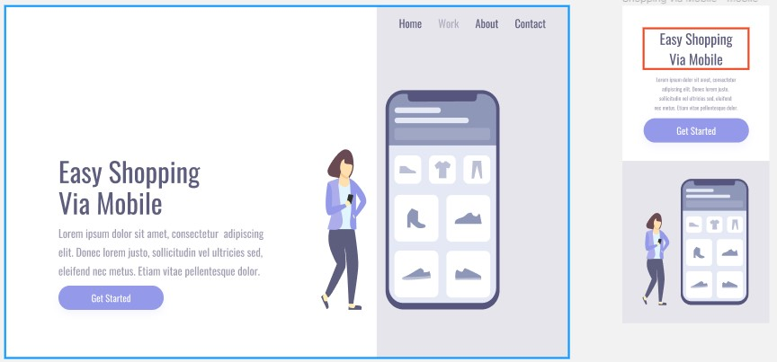

# HTML-and-CSS
treinando HTML

> 
Página estática , responsiva

### Ajustes e melhorias

O projeto ainda está em desenvolvimento e as próximas atualizações serão voltadas nas seguintes tarefas:

- [x] Criar HTML
- [x] Criar CSS
- [x] Responsividade
- [ ] incrementar JavaScript

## 🤝 Colaboradores

Agradecemos às seguintes pessoas que contribuíram para este projeto:

<table>
  <tr>
    <td align="center">
      <a href="#">
         
        
          <b>Kevin Mateus</b>
        
      </a>
    
  </tr>
</table>

